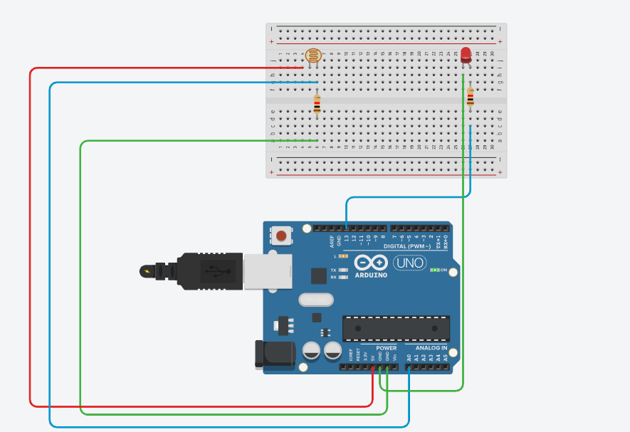

# 🌞 LDR-Based Light Controlled LED using Arduino Mega 2560

[](https://www.arduino.cc/)
[](LICENSE)

This project uses a Light Dependent Resistor (LDR) to measure ambient light and control an LED accordingly using an Arduino Mega 2560. It turns the LED **ON in darkness** and **OFF in light** automatically.

---

## 🔧 Components Required

| Component                | Quantity |
|--------------------------|----------|
| Arduino Mega 2560        | 1        |
| LDR (Light Sensor)       | 1        |
| 10kΩ Resistor            | 1        |
| LED                      | 1 (optional, or use built-in) |
| 330Ω Resistor (for LED)  | 1        |
| Breadboard & Jumper Wires| As needed |

---

## 🔌 Circuit Diagram



**Voltage Divider Setup:**

```

5V --- LDR --- A0 --- 10kΩ --- GND

````

*The LED is connected to digital pin 13 (or you can use the built-in LED on the Arduino Mega).*

---

## 💡 How It Works

- The **LDR** changes resistance based on light.
- A **voltage divider** outputs analog voltage to pin **A0**.
- The Arduino reads this analog value.
- If the value is **below a threshold** (i.e., dark), the LED is turned **ON**.
- If the value is **above the threshold** (i.e., bright), the LED is turned **OFF**.

---

## 📁 Project Structure

```bash
LDR-Light-Control/
├── LDE/
│   └── LDR_LED.ino          # Arduino sketch
├── images/
│   └── circuit_diagram.png  # Circuit diagram image
├── README.md
├── LICENSE
````

---

## 🚀 Getting Started

### 1️⃣ Clone this repository

```bash
git clone https://github.com/your-username/LDR-Light-Control.git
cd LDR-Light-Control/LDE
```

### 2️⃣ Upload the code

* Open `LDR_LED.ino` in the **Arduino IDE**
* Select board: **Arduino Mega 2560**
* Choose the correct **COM port**
* Upload the code

### 3️⃣ Test the circuit

* Open the **Serial Monitor**
* Cover/uncover the LDR and observe values
* LED should turn ON in darkness and OFF in light

---

## 📟 Sample Serial Output

```txt
LDR Value: 4
LED ON
LDR Value: 800
LED OFF
```

---

## 📜 License

This project is licensed under the **MIT License** – see the [LICENSE](LICENSE) file for details.

---

## 🙌 Credits

Created by [Dhananjay Kharkar](https://github.com/dhananjaykr9)

Feel free to fork, contribute, and improve this beginner-friendly IoT Arduino project!

---

```

### ✅ What Next?

Once you:
- Push the full repo (code + diagram + readme)
- Share the GitHub URL

I’ll help you:
- Add a GitHub repo banner image
- Generate custom shields (e.g., star, fork count, etc.)
- Suggest tags and topics for more visibility

Let me know if you want me to design a **GitHub banner image** too!
```
